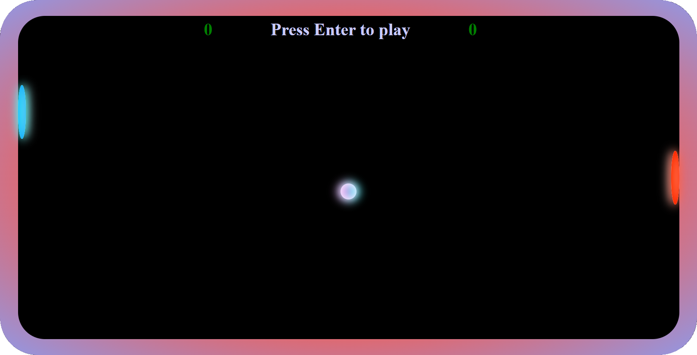
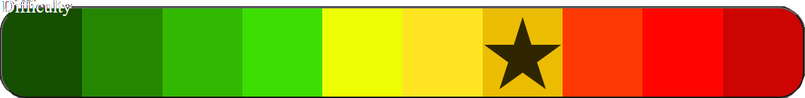

# GameBox
Welcome to GameBox ! An online platform where you can play online minigames and compete against other players
to find out who is the best.

List of minigames available for now:
- Pong
- Olympic 400m

List of minigames that will be implemented later:
- BopIt
- WPM Typewritter
- Reaction Speedtest
- Memory match
- Fruit Ninja
- Simon Says
- Obstacle Run
- Whack-a-Mole

## Pong
Pong Game (player vs machine) for web browsers

### Specs
- The game is fully resizable, it can adapt to any screen size dynamically, you can add it into any parent component
- 10 difficulty levels available
- An absolute eye candy
- Cool sound effects (may drive you nuts)
- The ball respawns with a random speed / angle every time
- Game speeds up every 8 rebounds (you won't be bored I promise)

### How To play
- Press Enter to start a game
- Press Space to pause a game
- Press Escape to end a game
- Choose difficulty level at the bottom of the page (can be changed during the game)
- Control your paddle with mouse cursor

